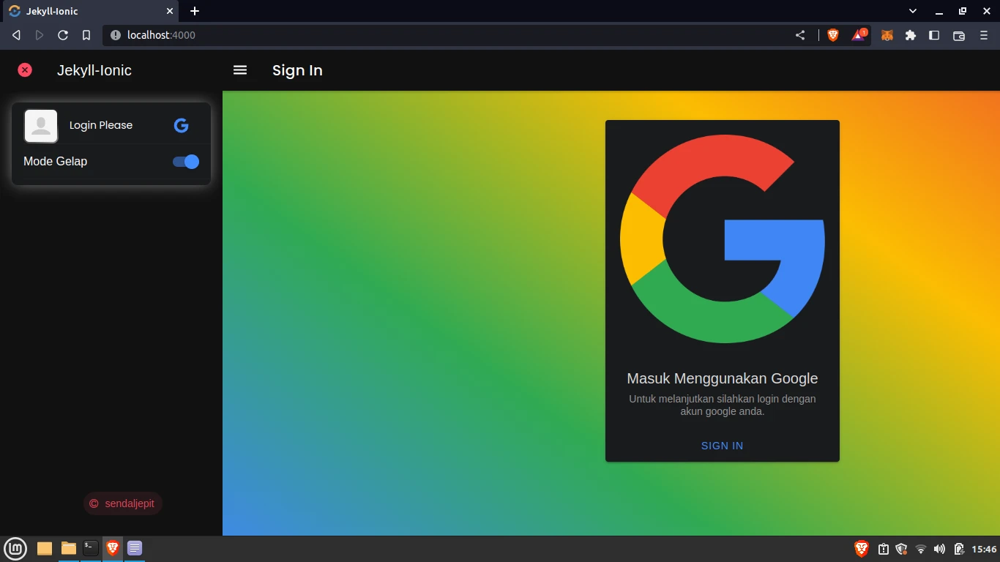

A static OnLine store & blog, base on jekyll, ionic & Custom simpleCartJS with whatsapp checkout form.

### Tech

 - Jekyll 4.2
 - Ionic 7.0(beta)
 - Gulp
 - Sass
 - Firebase
 - Javascript
 - SwipperJS


```shell
npm install
```

```shell
bundle install
```

```shell
bundle exec jekyll s
```

rules database firebase

```shell
{
  "rules": {
    "users": {
      "$uid": {
        ".read": "auth.uid === $uid",
        ".write": "auth.uid === $uid || root.child('users').child(auth.uid).child('role').val() === 'admin'"
      }
    }
  }
}
```

"Disclaimer: This website is a dummy or fake online store created for educational or testing purposes only. All products, pricing, and information displayed on this website are fictional and should not be taken as real or accurate. Any resemblance to actual products or stores is purely coincidental. This website should not be used for any commercial or transactional purposes. Any purchases made on this website are for testing purposes only and have no real-world value. By using this website, you acknowledge and agree that all transactions are at your own risk, and the website owner is not responsible for any losses or damages that may occur. Thank you for visiting this dummy or fake online store."



